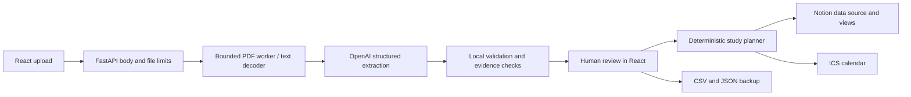

# Requirements and design decisions

## Scope decided before implementation

The core requirement is a reliable path from module handbooks to a usable semester plan and a Notion calendar, suitable for a short hackathon demo. The requested final stack is React/TypeScript and FastAPI. Reliability depends on two different kinds of work: uncertain language extraction and deterministic scheduling/export. They are kept separate.

| Requirement | Implementation | Deliberate boundary |
|---|---|---|
| Pull assessments from PDFs | Bounded local text extraction, chunking, OpenAI structured output | No OCR; source review is mandatory |
| Keep dates trustworthy | Nullable dates, source excerpts/pages, editable review gate | Quote matching is evidence location checking, not a proof that the extracted date is correct |
| Find deadline clashes | Counts per seven-day semester week; module weights kept separate | “Crunch” means 3+ deadlines; it is a transparent heuristic |
| Plan backwards | Earliest deadlines allocated first into latest free half-hour slots | Remaining hours are user estimates; not academic performance predictions |
| Respect real availability | Free weekdays, study window, time-off dates, deadline buffer | No automatic lecture/timetable or external calendar import |
| Organize in Notion | Data-source database, calendar and table views | One-way sync; official tokens required |
| Survive retries | Stable IDs, lookup before create, bounded read/update retries, explicit partial results | No distributed locks or exactly-once claims across multiple server instances |
| Demo without credentials | Synthetic fixture data, full manual entry, local exports | Demo does not pretend to make real AI or Notion requests |

## Data flow

`models.py` defines domain validation. `planner.py` is independent of HTTP and AI. `extraction.py` and `notion.py` own provider-specific behavior. FastAPI coordinates these modules; React owns user interaction and per-tab state. There is no unnecessary repository/service abstraction for a database the application does not use.

## Extraction decisions

Each document is fingerprinted with SHA-256. Pages are labelled before chunking. Long pages overlap to reduce the chance of splitting table rows. Repeated chunks/identical uploads converge on stable item IDs derived from the document digest, module, assessment name and kind. If values conflict for the same identity, the app preserves the existing entry and reports the conflict. A changed source file may have a different digest; duplicate names and excessive module weights are surfaced for human cleanup.

The OpenAI request has no tools. The document is treated as untrusted data, not instructions. `responses.parse` produces a schema-constrained result, and conversion validates dates, times, ranges and evidence locations. Refused or incomplete responses do not import partial results from that file. Successful earlier files in a multi-file upload remain saved. Evidence that cannot be matched clears the proposed date/time and adds a review note. Even matched evidence never bypasses review.

## Planning rules

1. Generate valid free half-hour slots between `plan_from` and semester end, excluding unavailable weekdays/days off/past times.
2. Sort reviewed assessments by earliest due date, then stable ID for deterministic tie breaking.
3. Leave deadline day free. `buffer_days=1` also leaves the preceding day free.
4. Allocate the latest available slots first, never reusing one for another assessment.
5. Coalesce adjacent slots into blocks up to the chosen length.
6. Report any remaining effort as unscheduled. Unknown/out-of-semester/on-or-before-start deadlines produce explicit shortfalls.

The allocator uses integer minutes so it conserves effort without floating-point rounding. Work estimates must be multiples of 30 minutes. All-day deadlines remain all-day in exports. Timed dates and study blocks use IANA timezone rules; ambiguous or nonexistent deadline wall times are rejected. Slots crossing daylight-saving changes are skipped with a note. No study block crosses midnight.

## Sync semantics

A project has an immutable UUID stored in its JSON backup. Notion keys are scoped to that project and an assessment/block ID. The app reads all matching rows before writing. Repeated syncs update rows, preserving `Done`. Removed entries become `Lifecycle=Superseded` only after all current rows were written successfully. The generated views show `Lifecycle=Active`.

The database's technical title includes the project UUID so a lost create response can be recovered from the parent page's child databases. Its description contains the human semester name. Keep the title unchanged for create recovery. Connecting an existing database verifies its schema. Duplicate keys halt the sync before writes.

Requests are paced below Notion's documented average request rate. Rate-limit replies honor bounded `Retry-After`; reads and idempotent property updates can retry transient errors. New-page/database/view writes are not retried blindly after ambiguous transport/5xx failures. Partial results explain what was confirmed and invite a reconciling re-sync. If writes succeeded but view setup failed, rows remain and the warning instructs a retry.

## Security and operating model

Secrets are environment-only. The application never writes raw uploads to a persistent store or serializes credentials into a project. Browser-origin controls require a custom header on mutations, restrict CORS to development origins, validate hosts, and cap request bodies before multipart parsing. React escapes displayed text; it never renders document text as HTML. CSV exports prefix spreadsheet formula triggers. IDs cannot turn a Notion request into an arbitrary URL.

These controls do not replace authentication. This release is scoped to one local operator with their own API credentials. Session storage is convenient local state, not secure server-side storage. Public multi-user operation requires a different credential/isolation design and operational monitoring. Long-running extraction/sync requests continue on the backend if the browser disconnects; the app does not claim cancellation or resumable background jobs. A restart loses in-flight work, so keep backups and use repeat-safe sync recovery.

## Known functional limits

- AI extraction can omit or misinterpret an assessment even when output is schema-valid. Review both the source and the complete extracted list.
- Teaching-week breaks/renumbering need manual review; semester-start edits do not automatically shift deadlines.
- Scheduling is a feasible-slot heuristic. It does not optimize learning science, task dependencies, breaks within the available window, or user energy levels.
- The app does not import Notion completion changes or merge simultaneous edits across devices.
- ICS files are snapshots; different calendar apps handle repeat imports differently. Use a dedicated imported calendar that can be replaced.
- Running multiple backend workers bypasses the in-process operation locks; use one worker in this release.
